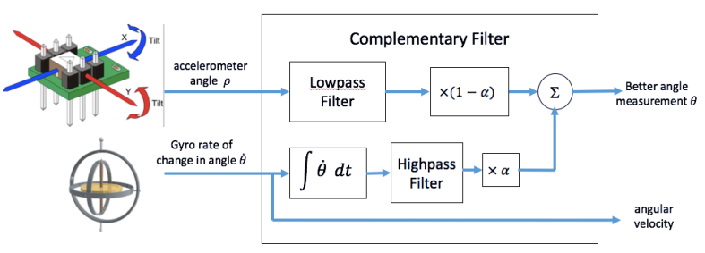

# IMU Data Acquisition and Filtering with Complementary Filter using MPU6050 and Arduino 🚀

## Overview 

This project focuses on acquiring data from the **MPU6050** Inertial Measurement Unit (IMU) using the **MPU6050.h** library on an Arduino microcontroller. The MPU6050 combines a **3-axis accelerometer** and a **3-axis gyroscope**, providing both linear acceleration and angular velocity data. These sensor readings are then processed using a **complementary filter** to produce a more accurate estimate of orientation.

### Key Components:
- **MPU6050 IMU**: A 6-DOF (Degrees of Freedom) IMU that provides real-time acceleration and gyroscope data.
- **MPU6050.h Library**: A convenient library that simplifies the interface with the MPU6050, allowing easy access to sensor data.
- **Arduino UNO R3**: Microcontroller used to read and process the data from the MPU6050 sensor.
- **Complementary Filter**: An algorithm that combines accelerometer and gyroscope data to provide a smooth, drift-free orientation estimate.

## Why Use MPU6050 and Complementary Filters? 🤔

### 1. **Sensor Fusion with MPU6050 for Better State Estimation** 🎯

The **MPU6050** is a commonly used IMU in control systems for tracking orientation and motion. It contains two sensors:
- **Accelerometer**: Measures linear acceleration and is capable of estimating tilt angles relative to gravity.
- **Gyroscope**: Measures angular velocity, useful for tracking fast rotational changes.

However, these sensors have limitations when used alone:
- The **accelerometer** is sensitive to external forces and vibrations, leading to noisy signals during dynamic movement.
- The **gyroscope** accumulates **drift** over time, which leads to incorrect orientation estimates if not corrected.

The **complementary filter** effectively **fuses the accelerometer and gyroscope data**, taking advantage of the strengths of each:
- **Low-pass filtering** is applied to the accelerometer data for reliable long-term orientation estimates.
- **High-pass filtering** is applied to gyroscope data for short-term, high-frequency motion, compensating for drift.

 
  

This sensor fusion results in accurate, stable orientation estimates, essential for real-time control systems.

### 2. **Advantages for Control Systems Engineering** ⚙️

From a control systems perspective, the use of the complementary filter with the MPU6050 provides several key benefits:

#### **Mitigation of Gyroscope Drift and Accelerometer Noise** 
- **Gyroscope drift** is a major concern in control systems because it leads to cumulative errors in orientation, destabilizing feedback loops over time. The complementary filter corrects drift by continuously realigning the gyroscope's fast responses with the long-term stable reading of the accelerometer.
- **Accelerometer noise**, especially in dynamic environments (e.g., robotics, drones), is filtered out by the complementary filter, ensuring that the system is not overly influenced by high-frequency disturbances.

This ensures the **accuracy and stability of the state estimation**, which is crucial for reliable control system behavior.

#### **Real-Time Processing with Arduino** ⚡
In control systems, **real-time feedback** is vital to ensure the system responds quickly and accurately. The **MPU6050.h** library simplifies data acquisition by handling the communication with the IMU efficiently, while the complementary filter offers a computationally lightweight algorithm for data fusion. This makes the system suitable for **embedded, real-time applications** like robotic control, stabilization platforms, or drones.

Compared to more computationally intensive filtering methods like the Kalman filter, the complementary filter provides a **balance between performance and simplicity**, ensuring that real-time constraints on platforms like Arduino are met without compromising on accuracy.

#### **Dynamic Response in Non-Ideal Environments**
Control systems are often deployed in environments with external forces and unpredictable motion. The complementary filter ensures robust performance in such conditions by handling both **slow and steady movements** (via the accelerometer) and **fast, dynamic rotations** (via the gyroscope). This is especially important in applications such as:
- **Robotics** 🤖: Where precision and stability in orientation are required.
- **Drones** 🚁: Where accurate and quick orientation updates are essential for stability.
- **Vehicle control systems** 🚗: Where sensor data needs to be filtered quickly and efficiently to maintain control.

The complementary filter applied to the MPU6050 data ensures reliable orientation tracking, even in the presence of disturbances or vibrations.

### 3. **Ease of Use with MPU6050.h Library**
The **MPU6050.h** library simplifies the process of reading data from the IMU. Instead of dealing with raw I2C communication protocols, the library abstracts these details, allowing you to easily retrieve acceleration and gyroscope values with a few function calls.

The combination of **Arduino** with the **MPU6050.h** library makes this setup ideal for rapid prototyping in control systems, enabling engineers to focus on algorithm development and system design without getting bogged down by sensor communication issues.

---

## Conclusion 🏁

This project demonstrates how to use the **MPU6050 IMU** with the **MPU6050.h** library on Arduino for real-time data acquisition, filtered with a **complementary filter**. The complementary filter combines the accelerometer's long-term stability with the gyroscope's fast response, ensuring accurate and reliable orientation estimates. For control systems engineers, this approach provides a **computationally efficient**, **real-time capable**, and **robust solution** for state estimation in dynamic environments. Check out the results on the report and feel free to use the code!

---

